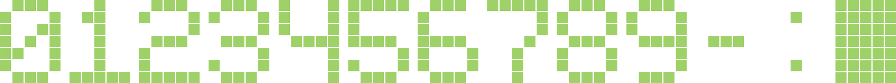
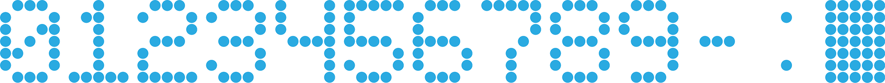
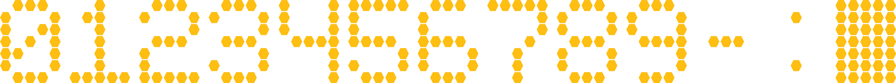
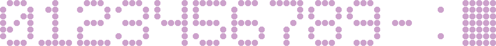

# Comentsys.Assets.Display

**Comentsys.Assets.Display** is an **Asset Resource** in **.NET Standard** for **Displays** including **Segment** and **Matrix** using **Comentsys.Toolkit**.

## Change Log

### Version 2.0.0

- Updated Display for Matrix with Style including Square, Circle, Hexagon and Octagon

### Version 1.0.0

- Initial Release

## Segment

`Segment` represents a **Seven-Segment Display**

You can also supply an **Array** of **Colours** or a single **Colour** to customise the **Segment** by replacing **Fill** used in 
the **Asset** to the various **Methods** to `Get` an **Asset Resource**.

### Example


### Get(value, fill)

Get Asset Resource

| Name | Description |
| ---- | ----------- |
| value | *Comentsys.Assets.Display.Value*<br>Value |
| fill | *System.Drawing.Color[]*<br>Fill Colours |

#### Returns

Asset Resource

### Get(value, fill)

Get Asset Resource

| Name | Description |
| ---- | ----------- |
| value | *Comentsys.Assets.Display.Value*<br>Value |
| fill | *System.Nullable{System.Drawing.Color}*<br>Fill Colour |

#### Returns

Asset Resource

### Get(value)

Get Asset Resource

| Name | Description |
| ---- | ----------- |
| value | *Comentsys.Assets.Display.Value*<br>Value |

#### Returns

Asset Resource

### Get(value, fill)

Get Asset Resource

| Name | Description |
| ---- | ----------- |
| value | *System.Int32*<br>Value |
| fill | *System.Drawing.Color[]*<br>Fill Colours |

#### Returns

Asset Resource

### Get(value, fill)

Get Asset Resource

| Name | Description |
| ---- | ----------- |
| value | *System.Int32*<br>Value |
| fill | *System.Nullable{System.Drawing.Color}*<br>Fill Colour |

#### Returns

Asset Resource

### Get(value)

Get Asset Resource

| Name | Description |
| ---- | ----------- |
| value | *System.Int32*<br>Value |

#### Returns

Asset Resource

## Matrix

`Matrix` represents a **Five-by-Seven Dot Matrix Display** where you can select a `Style` for each **Pixel** of the `Matrix` from `Square`, `Circle`, `Hexagon` and `Octagon`.

You can also supply an **Array** of **Colours** or a single **Colour** to customise the **Matrix** by replacing **Fill** used in the **Asset** to the various **Methods** to `Get` an **Asset Resource**.

### Examples

#### Matrix - Square



#### Matrix - Circle



#### Matrix - Hexagon



#### Matrix - Octagon



### Get(value, fill, style)

Get Asset Resource

| Name | Description |
| ---- | ----------- |
| value | *Comentsys.Assets.Display.Value*<br>Value |
| fill | *System.Drawing.Color[]*<br>Fill Colours |
| style | *Comentsys.Assets.Display.Style*<br>Style |

#### Returns

Asset Resource

### Get(value, fill, style)

Get Asset Resource

| Name | Description |
| ---- | ----------- |
| value | *Comentsys.Assets.Display.Value*<br>Value |
| fill | *System.Nullable{System.Drawing.Color}*<br>Fill Colour |
| style | *Comentsys.Assets.Display.Style*<br>Style |

#### Returns

Asset Resource

### Get(value, style)

Get Asset Resource

| Name | Description |
| ---- | ----------- |
| value | *Comentsys.Assets.Display.Value*<br>Value |
| style | *Comentsys.Assets.Display.Style*<br>Style |

#### Returns

Asset Resource

### Get(value, fill, style)

Get Asset Resource

| Name | Description |
| ---- | ----------- |
| value | *System.Int32*<br>Value |
| fill | *System.Drawing.Color[]*<br>Fill Colours |
| style | *Comentsys.Assets.Display.Style*<br>Style |

#### Returns

Asset Resource

### Get(value, fill, style)

Get Asset Resource

| Name | Description |
| ---- | ----------- |
| value | *System.Int32*<br>Value |
| fill | *System.Nullable{System.Drawing.Color}*<br>Fill Colour |
| style | *Comentsys.Assets.Display.Style*<br>Style |

#### Returns

Asset Resource

### Get(value, style)

Get Asset Resource

| Name | Description |
| ---- | ----------- |
| value | *System.Int32*<br>Value |
| style | *Comentsys.Assets.Display.Style*<br>Style |

#### Returns

Asset Resource

## Value

`Value` represents the **Display Value** supported by `Segment` and `Matrix` including numbers `0` to `9` and `-`, `:` along with a `Display` that is `Blank` or `Filled`

### Zero

Represents Zero (0)
		   
### One	   
		   
Represents One (1)
		   
### Two	   
		   
Represents Two (2)
		   
### Three  
		   
Represents Three (3)
		   
### Four   
		   
Represents Four (4)
		   
### Five   
		   
Represents Five (5)
		   
### Six	   
		   
Represents Six (6)
		   
### Seven  
		   
Represents Seven (7)
		   
### Eight  
		   
Represents Eight (8)
		   
### Nine   
		   
Represents Nine (9)

### Dash

Represents Dash (-)

### Colon

Represents Colon (:)

### Blank

Represents Blank ( )

### Filled

Represents Filled

## Style

`Style` represents the **Matrix Style**  to represent the **Shape** of each **Pixel** of the `Matrix`.

### Square

Square

### Circle

Circle

### Hexagon

Hexagon

### Octagon

Octagon

## Licence

```
The MIT License (MIT)

Copyright (c) Comentsys

Permission is hereby granted, free of charge, to any person obtaining a copy of
this software and associated documentation files (the "Software"), to deal in
the Software without restriction, including without limitation the rights to
use, copy, modify, merge, publish, distribute, sublicense, and/or sell copies
of the Software, and to permit persons to whom the Software is furnished to do
so, subject to the following conditions:

The above copyright notice and this permission notice shall be included in all
copies or substantial portions of the Software.

THE SOFTWARE IS PROVIDED "AS IS", WITHOUT WARRANTY OF ANY KIND, EXPRESS OR
IMPLIED, INCLUDING BUT NOT LIMITED TO THE WARRANTIES OF MERCHANTABILITY,
FITNESS FOR A PARTICULAR PURPOSE AND NONINFRINGEMENT. IN NO EVENT SHALL THE
AUTHORS OR COPYRIGHT HOLDERS BE LIABLE FOR ANY CLAIM, DAMAGES OR OTHER
LIABILITY, WHETHER IN AN ACTION OF CONTRACT, TORT OR OTHERWISE, ARISING FROM,
OUT OF OR IN CONNECTION WITH THE SOFTWARE OR THE USE OR OTHER DEALINGS IN THE
SOFTWARE.
```